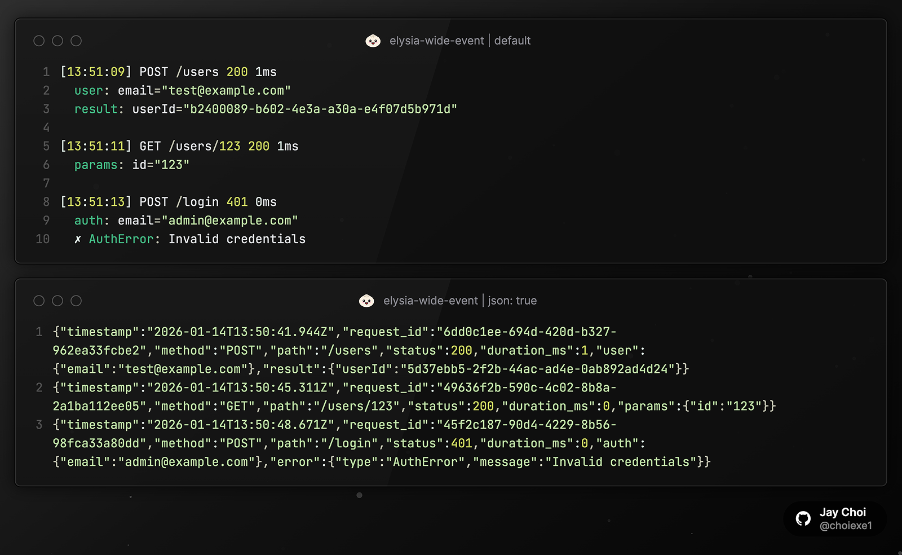

# elysia-wide-event

[](../LICENSE)
[](https://bun.sh)
[](../README.md)

[Elysia](https://elysiajs.com)를 위한 Wide Event 로깅 플러그인. 요청의 모든 컨텍스트를 하나의 구조화된 로그 라인으로 집계하여 관측성을 높입니다.

[Logging Sucks](https://loggingsucks.com/)에서 영감을 받았습니다 - 디버깅을 즐겁게 만드는 Wide Event 패턴.



> **Bun + Elysia 전용.** 이 플러그인은 Bun 런타임과 Elysia 프레임워크 전용으로 설계되었습니다. Node.js는 지원하지 않습니다.

## 기능

- **서버 시작 로그**: `start` 옵션으로 서버 시작 시 커스텀 데이터 로깅
- **컨텍스트 수집**: `wideEvent.set()`으로 요청 생명주기 전반에 걸쳐 데이터 수집
- **유연한 출력**: 컬러 출력 또는 JSON - 선택 가능
- **Request ID**: `x-request-id` 헤더에서 추출하거나 자동 생성
- **성능 측정**: 요청 처리 시간 자동 추적

## 설치

```bash
bun add elysia-wide-event
```

## 빠른 시작

```typescript
import { Elysia } from "elysia";
import { wideEvent } from "elysia-wide-event";

const app = new Elysia()
  .use(wideEvent())
  .post("/users", ({ wideEvent, body }) => {
    wideEvent.set("user", { email: body.email });

    const userId = "abc-123";
    wideEvent.set("result", { userId });

    return { success: true };
  })
  .listen(3000);
```

## 출력

위 스크린샷 참조. 기본값은 컬러 출력, `json: true` 옵션으로 JSON 출력.

## 옵션

```typescript
wideEvent({
  generateRequestId: () => crypto.randomUUID(),
  requestIdHeader: "x-request-id",
  json: false,
  start: { env: "production", version: "1.0.0" },
});
```

| 옵션                | 타입           | 기본값              | 설명                                        |
| ------------------- | -------------- | ------------------- | ------------------------------------------- |
| `generateRequestId` | `() => string` | `crypto.randomUUID` | 커스텀 Request ID 생성기                    |
| `requestIdHeader`   | `string`       | `"x-request-id"`    | Request ID를 가져올 헤더                    |
| `json`              | `boolean`      | `false`             | Pretty 대신 JSON으로 출력                   |
| `start`             | `LogData`      | `undefined`         | 서버 시작 시 로깅할 커스텀 데이터 (URL 자동 포함) |

## API

### `wideEvent.set(key, data)`

현재 요청 로그에 컨텍스트 추가.

```typescript
wideEvent.set("auth", { userId: "123", role: "admin" });
```

### `wideEvent.error(data)`

에러 상세 정보 로깅. 어떤 객체든 허용.

```typescript
wideEvent.error({ type: "ValidationError", message: "Invalid email" });
wideEvent.error({ code: "E001", reason: "timeout" });
```

## 요구사항

- Bun >= 1.0.0
- Elysia >= 1.0.0

## 라이선스

MIT
